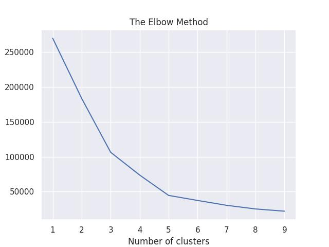
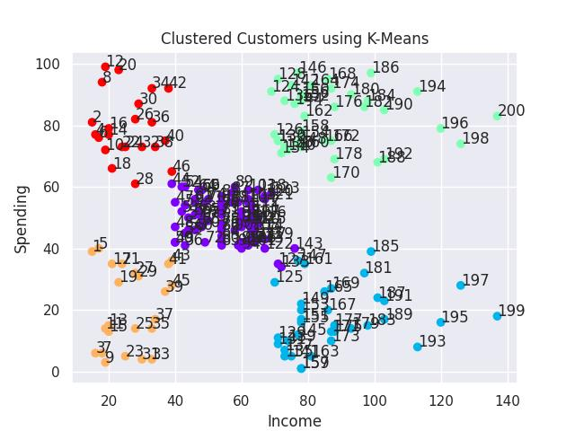

## Cluster customers based on their income and spending using K-Means

To determine the optimal number of clusters, we have to select the value of k at the “elbow” ie the point after which the distortion/inertia start decreasing in a linear fashion. Thus for the given data, we conclude that the optimal number of clusters for the data is 5.

1. There are 5 clusters.
2. The top priority is the green cluster (high income and high spending). To make sure we get their retention we can introduce some sort of loyalty system.
3. Our second most important priority is the red cluster (low income and high spending). Same as the green cluster, we can use loyalty system to have their retention.
4. Next is the purple cluster (medium income and medium spending). Their potential to become green cluster (high income and high spending customers) can't be underestimated. We can introduce a subcription system and promos to keep them on our platform and to make them spend more.
5. Blue cluster (high income and low spending) and yellow cluster (low income and low spending) can be attracted to spend more with promos.